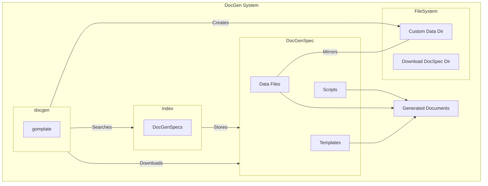

# Generate documents 

Create any type of document from structured data in formats such as json.

Use tools like pandoc to post process files and convert to other formats.

## Requirements

- [gomplate](https://docs.gomplate.ca/)
- [gum](https://github.com/charmbracelet/gum)
- [fzf](https://github.com/junegunn/fzf)

## Usage

Run the docgen cli:

```
docgen
```

This will list all the available document generators with fzf and other options to choose from.
select you're preferred configuration and a file should be generated in your current working directory or to `stdout.

## Using DocGenSpec (document generator)

`DocGenSpec`s provide all necessary files to generate a specialized document.

Clone or create a [DocGenSpec](https://github.com/DanielCardonaRojas/DocGenSpec).

```sh
./scripts/clone.sh GITHUB_URL
```

or 

```sh
./scripts/scaffold.sh SPEC_NAME
```

## Environment variable

DocGen will install and search for DocGenSpecs at `$DOCGEN_PATH` which defaults to `$HOME/.config/docgen` if not set.


## System


